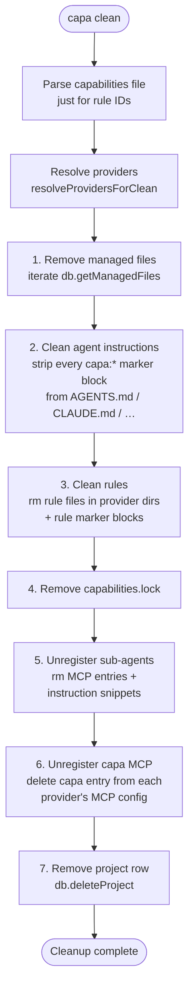

# CAPA Maintainer Docs

This folder is for people working **on** capa, not people using it. End-user docs
(getting started, the capabilities schema reference, the registry catalog) live
in a separate repo and are published at <https://capa.infragate.ai>. Anything
that explains how capa is wired together internally — install pipeline ordering,
per-provider quirks, lockfile semantics, the database schema, etc. — belongs
here.

> If you're trying to learn capa as a user, read the top-level
> [`README.md`](../README.md) instead.

## Contents

- [Installation pipeline](#installation-pipeline) — how `capa install` parses
  the capabilities file and writes per-provider artifacts, and how
  `capa clean` rolls those artifacts back.
- [Key abstractions](#key-abstractions) — the provider registry, marker
  blocks, the managed-files table, and the lockfile.
- [Plugin discovery and unpack](#plugin-discovery-and-unpack) — how capa
  consumes upstream plugin repos and decomposes them into the same
  primitives every other capability uses.
- [Providers](#providers) — entry point into the per-provider docs and the
  compatibility matrix.

---

## Installation pipeline

`capa install` is implemented as an ordered list of tasks declared in
[`src/cli/commands/install-tasks/index.ts`](../src/cli/commands/install-tasks/index.ts).
Each task receives a shared `InstallCtx` (see
[`install-tasks/context.ts`](../src/cli/commands/install-tasks/context.ts))
that accumulates resolved capabilities, lockfile state, managed-files tracking,
warnings, and errors as the pipeline progresses. Order matters — most tasks
depend on state set by an earlier task.

### Install flow

```mermaid
flowchart TD
    Start([capa install]) --> Detect[Detect capabilities.yaml<br/>or capabilities.json]
    Detect --> Parse[Parse capabilities file<br/>parseCapabilitiesFile]
    Parse --> EnsureServer[Ensure local server is running<br/>ensureServer]
    EnsureServer --> ResolveProviders[Resolve providers list<br/>flag → file → DB → detect]
    ResolveProviders --> InitCtx[Build InitCtx:<br/>db, lockBuilder, mcpUrl, …]

    InitCtx --> ReqCmds{requiresCommands<br/>defined?}
    ReqCmds -- yes --> Verify[verify-prerequisites<br/>check CLI binaries via --version]
    ReqCmds -- no --> Plugins
    Verify --> Plugins

    Plugins{capabilities.plugins<br/>set?}
    Plugins -- yes --> ResolvePlugins[resolve-plugins<br/>clone plugin repos, parse manifests,<br/>merge skills/servers/tools into<br/>ctx.capabilitiesToUse]
    Plugins -- no --> ValidatePlugins
    ResolvePlugins --> ValidatePlugins

    ValidatePlugins{type: plugin skills<br/>or resolvedPlugins?}
    ValidatePlugins -- yes --> ValidatePluginConfig[validate-plugin-config<br/>warn on unreferenced plugin servers]
    ValidatePlugins -- no --> Env
    ValidatePluginConfig --> Env

    Env{--env flag<br/>set?}
    Env -- yes --> LoadEnv[load-env<br/>parse .env, persist<br/>variables to DB]
    Env -- no --> Cleanup
    LoadEnv --> Cleanup

    Cleanup[check-removed-skills<br/>rm skill dirs no longer<br/>in capabilities] --> InstallSkills

    InstallSkills[install-skills<br/>fetch GitHub/GitLab snapshots,<br/>copy SKILL.md trees into each<br/>provider's skillsDir]
    InstallSkills --> WriteLock

    WriteLock[write-lockfile<br/>prune to current skill+plugin IDs,<br/>persist capabilities.lock]
    WriteLock --> AgentInstr

    AgentInstr{capabilities.agents<br/>set?}
    AgentInstr -- yes --> InstallAgentInstr[install-agent-instructions<br/>render base + additional snippets<br/>into AGENTS.md / CLAUDE.md / …]
    AgentInstr -- no --> PruneRules
    InstallAgentInstr --> PruneRules

    PruneRules[prune-orphan-rules<br/>delete rule files & marker blocks<br/>no longer in capabilities] --> InstallRules

    InstallRules{capabilities.rules<br/>set?}
    InstallRules -- yes --> WriteRules[install-rules<br/>provider has rules dir → write file,<br/>else → fold into instructions<br/>file as marker block]
    InstallRules -- no --> ConfigureTools
    WriteRules --> ConfigureTools

    ConfigureTools[configure-tools<br/>POST capabilities to local server,<br/>validate MCP/command tools] --> RegisterMcp

    RegisterMcp{tools or<br/>sub-agents present?}
    RegisterMcp -- yes --> Register[register-mcp-server<br/>write capa MCP entry into each<br/>provider's MCP config]
    RegisterMcp -- no --> Unregister[unregister capa entry<br/>nothing left to expose]
    Register --> Subagents
    Unregister --> Subagents

    Subagents[install-subagents<br/>purge stale entries,<br/>unregister removed agents,<br/>register current agents +<br/>write subagent files + snippets]
    Subagents --> Creds

    Creds{configureResult<br/>needs creds?}
    Creds -- yes --> OpenBrowser[open-credential-setup<br/>open web UI for missing<br/>variables or OAuth2 connect]
    Creds -- no --> Done
    OpenBrowser --> Done([Summary printed,<br/>db closed])
```

### Task reference

Each task lives in its own file under
[`src/cli/commands/install-tasks/`](../src/cli/commands/install-tasks/). The
table below is a quick map of what each task reads/writes.

| Task | File | Reads | Writes |
| --- | --- | --- | --- |
| `verify-prerequisites` | `verify-prerequisites.ts` | `capabilities.options.requiresCommands` | exits on missing CLI |
| `resolve-plugins` | `resolve-plugins.ts` | `capabilities.plugins`, lockfile, snapshot cache | `ctx.capabilitiesToUse`, lock entries, temp dirs |
| `validate-plugin-config` | `validate-plugin-config.ts` | merged capabilities | warnings |
| `load-env` | `load-env.ts` | `.env`, `extractAllVariables(...)` | `db.setVariable` per `${VAR}` |
| `check-removed-skills` | `check-removed-skills.ts` | DB managed-files, current skill IDs | rm skill dirs |
| `install-skills` | `install-skills.ts` | `capabilities.skills`, snapshot cache | per-provider skill dirs, lock entries |
| `write-lockfile` | `write-lockfile.ts` | `lockBuilder` | `capabilities.lock` (or rm if empty) |
| `install-agent-instructions` | `install-agent-instructions.ts` | `capabilities.agents` | `AGENTS.md`, `CLAUDE.md`, `.github/copilot-instructions.md`, … |
| `prune-orphan-rules` | `prune-orphan-rules.ts` | DB managed-files, current rule IDs | rm rule files/marker blocks |
| `install-rules` | `install-rules.ts` | `capabilities.rules`, snapshot cache | per-provider rules dir **or** marker blocks in instructions file |
| `configure-tools` | `configure-tools.ts` | merged capabilities | POSTs to `/api/projects/:id/configure`, stores `configureResult` |
| `register-mcp-server` | `register-mcp-server.ts` | provider registry, mcpUrl | provider MCP config (`.cursor/mcp.json`, `.mcp.json`, …) |
| `install-subagents` | `install-subagents.ts` | `capabilities.subagents`, DB sub-agents | sub-agent files, sub-agent MCP entries, instructions snippets |
| `open-credential-setup` | `open-credential-setup.ts` | `configureResult` | opens browser |

### Clean flow

`capa clean` ([`src/cli/commands/clean.ts`](../src/cli/commands/clean.ts)) is
the inverse of install. It uses the **database** (not the on-disk
`capabilities.yaml` alone) as the source of truth for what to remove, because
the user may have already edited or deleted entries. Order matters: managed
files are removed before sub-agents are unregistered so failures part-way
through still converge on a clean state on the next run.

### Key abstractions

- **Provider registry** (`src/shared/providers/registry.ts`). The single source
  of truth for everything per-provider: skills dir, MCP config path, rules dir,
  sub-agents dir, plugin manifest paths, etc. Every install/clean task reads
  from this registry rather than hard-coding provider IDs. Add a new provider
  here and the rest of the pipeline picks it up automatically — subject to
  which optional fields you populate (see the
  [compatibility matrix](./providers/README.md#compatibility-matrix) and
  the per-provider pages under [`docs/providers/`](./providers/)).

- **Marker blocks**. Rules and sub-agents are folded into instruction files
  using HTML comment markers (`<!-- capa:start:rule:foo --> … <!-- capa:end:rule:foo -->`).
  See `agents-file.ts` and `rules-installer.ts` — both implement the same
  `upsertSnippet` / `removeSnippet` / `listCapaSnippetIds` pattern.

- **Managed-files table**. `db.addManagedFile(projectId, absPath)` records
  anything capa wrote outside marker blocks (skill dirs, rule files). Both
  `check-removed-skills` and `prune-orphan-rules` use it to find files to
  delete on the next install when entries disappear from the capabilities
  file. `capa clean` iterates the same table.

- **Lockfile**. `capabilities.lock` pins resolved commit SHAs for every
  `github`/`gitlab` skill and plugin. The lockfile is built incrementally
  during install (`ctx.lockBuilder.upsertSkill/upsertPlugin`) and pruned to the
  current set of IDs at the end. `--no-cache` disables both lockfile lookups
  and the on-disk snapshot cache.

---

## Plugin discovery and unpack

Capa does **not** install plugins as units; the
[provider compatibility matrix](./providers/README.md#compatibility-matrix)
is the authoritative description of what ends up on disk. A
`capabilities.plugins` entry is a *source* — typically a git repo — that
capa clones, inspects, and decomposes into the same primitives every
other capability uses
(`skills`, `mcpServers`, `mcpTools`). Those primitives are then merged into
`ctx.capabilitiesToUse` and flow through the same `install-skills`,
`register-mcp-server`, `install-subagents` … tasks as if the user had
written them inline.

The discovery pipeline lives in
[`src/cli/commands/plugin-install.ts`](../src/cli/commands/plugin-install.ts)
and [`src/shared/plugin-manifest/detect.ts`](../src/shared/plugin-manifest/detect.ts):

1. **Resolve the source.** `resolvePlugins` clones (or reuses a cached
   snapshot of) each plugin repo and computes a lockfile entry.
2. **Find the manifest.** `detectAndParseManifest` walks the provider
   registry, asking each integrated provider for its
   `pluginManifestPaths`. The first matching file inside the repo wins.
   Claude-shaped manifests are hoisted to the front of the queue because
   many real-world plugins ship both `.claude-plugin/plugin.json` and
   `.cursor-plugin/plugin.json`, and only the Claude variant carries a
   complete OAuth2 block.
3. **Parse it.** The matched provider either declares a custom
   `parsePluginManifest` callback or the parser falls back to the two
   built-in shapes: `parseClaudeManifest` and `parseCursorManifest`. Any
   other format is currently unsupported — see
   [Plugin format support](#plugin-format-support) below.
4. **Discover-mode fallback.** If no manifest is found, capa still scans
   for a top-level `skills/` directory and a `.mcp.json` and treats them as
   a claude-shaped pseudo-manifest.
5. **Decompose and merge.** The `UnifiedPluginManifest` exposes
   `skillEntries`, `mcpServers`, and `mcpTools`. Each becomes a regular
   capability entry that the normal install tasks pick up — there is no
   separate plugin-write step.

### Plugin format support

Only two manifest schemas are wired up today: Claude (`.claude-plugin/`)
and Cursor (`.cursor-plugin/`). The corresponding `pluginManifestPaths`
declarations on those provider entries are the inputs to step 2 above.

Several other providers ship their own plugin manifest formats
(`.augment-plugin/plugin.json`, `.factory-plugin/plugin.json`,
`.kode-plugin/plugin.json`). We deliberately do **not** declare them in
the registry today because step 3 would fall through silently — capa
would find the manifest, fail to dispatch to a parser, and silently
return no capabilities. The registry comments on
[`augment`](../src/shared/providers/registry.ts), `droid`, and `kode`
record this and the
[`Plugin manifest declarations are gated on parser support`](../src/shared/providers/__tests__/registry.test.ts)
test asserts the rollback can't regress unintentionally.

To onboard a new plugin format, either:

- Confirm the schema is identical to Claude or Cursor's and reuse the
  existing parser via `pluginProviderId: 'claude' | 'cursor'`, or
- Add a `parsePluginManifest(repoRoot, data, manifestDir)` callback to
  the provider entry that returns a `UnifiedPluginManifest`.

The per-provider pages flag manifest formats that are documented but not
yet wired up (currently Augment, Droid, Kode).

---

## Providers

Per-provider documentation lives under [`docs/providers/`](./providers/),
one markdown file per provider. The catalogue is intentionally split out
so a maintainer (or an LLM) can load just the provider they care about
without scanning a 400-line catch-all.

- [Provider docs index](./providers/README.md) — landing page with the
  full [compatibility matrix](./providers/README.md#compatibility-matrix),
  providers grouped by integration tier (full / partial / held back / not
  integrated), the per-page conventions, and the research methodology.

What capa actually does for each feature depends on which optional fields
are set on the `ProviderIntegration` entry in
[`src/shared/providers/registry.ts`](../src/shared/providers/registry.ts).
That registry — together with [`src/types/providers.ts`](../src/types/providers.ts)
which defines the field shapes — remains the source of truth; the docs
under `docs/providers/` are the human-readable view of the same data.
